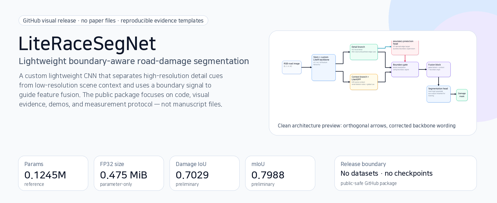
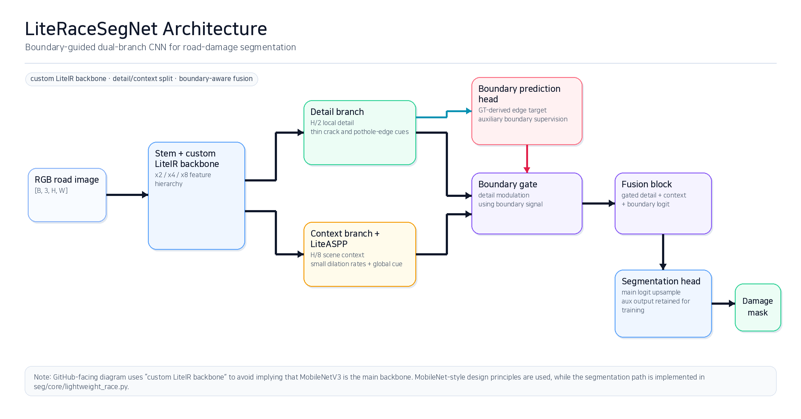
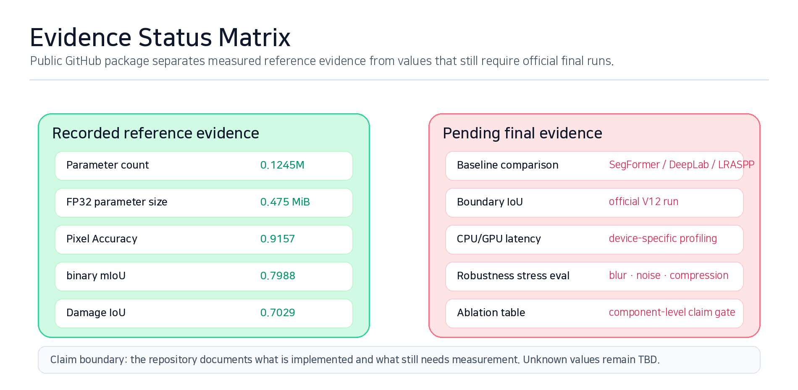
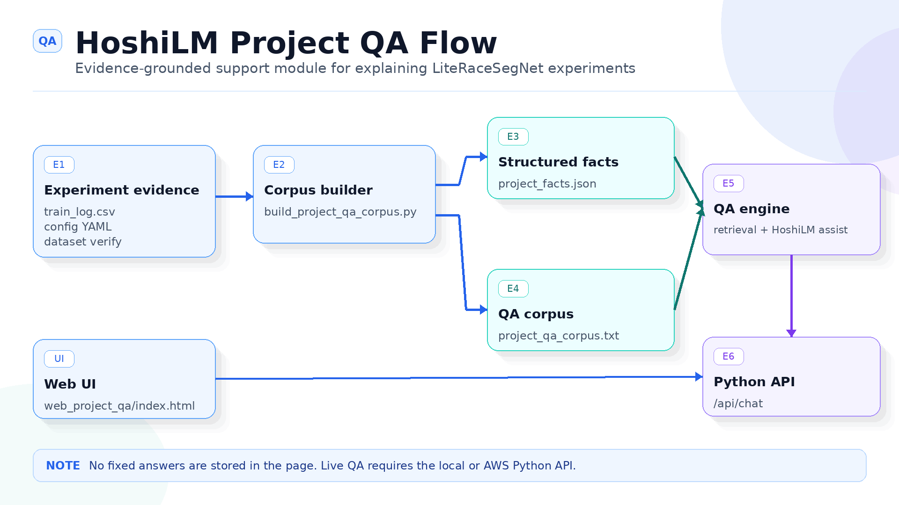
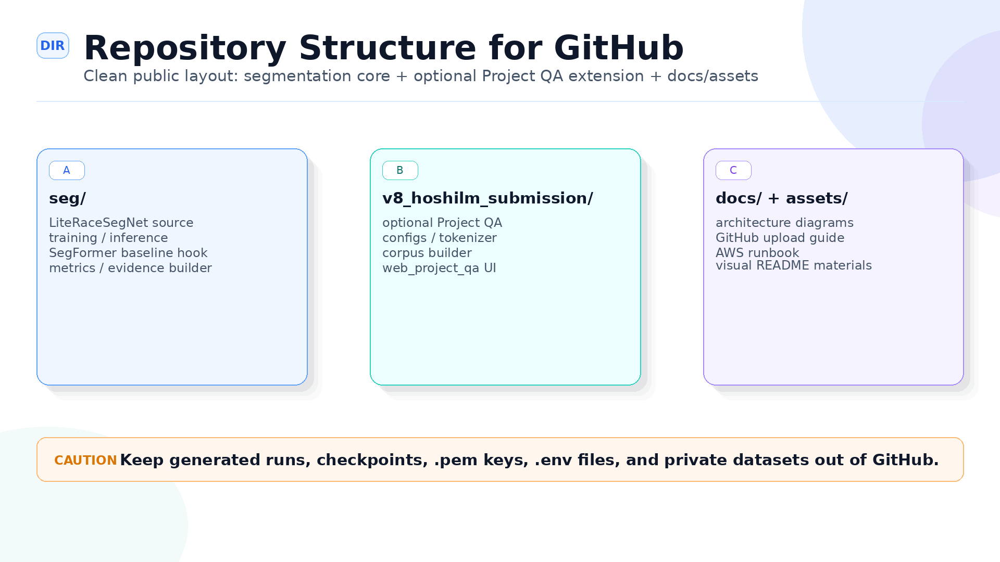
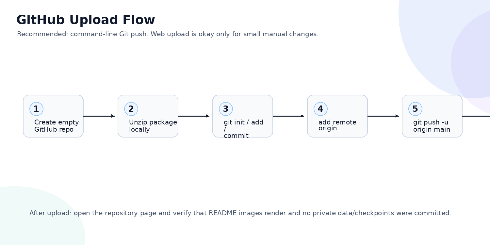

# LiteRaceSegNet-V11


<p align="center">
  
</p>

**LiteRaceSegNet-V11** is a public portfolio package for a lightweight road-damage semantic segmentation project. It focuses on a practical research question: **can a compact boundary-aware CNN preserve small road-damage masks and irregular edges while staying deployable under CPU/GPU constraints?**

This repository contains the segmentation source code, static demos, diagrams, evidence templates, scripts, and an optional HoshiLM Project QA module for explaining experiment evidence. Manuscript files, private datasets, raw masks, checkpoints, pretrained weights, and credentials are intentionally excluded.

> Suggested repository description:  
> `Lightweight road-damage segmentation with a boundary-guided dual-branch CNN and CPU/GPU evidence pipeline.`

---

## Visual overview

The main model is LiteRaceSegNet: a custom lightweight CNN with detail/context separation, LiteASPP context aggregation, boundary supervision, and boundary-guided fusion.

<p align="center">
  
</p>

The GitHub-facing diagrams in this package were regenerated with **custom text and geometry only**. Ambiguous decorative icons were removed to reduce copyright/trademark risk. The corrected diagram uses the current wording: **custom LiteIR-style lightweight backbone**, not a direct MobileNetV3 backbone claim.

---

## Project position

LiteRaceSegNet is not presented as a completed SOTA claim. The repository is organized around a defensible research/evaluation frame:

| Axis | What this repo shows | Why it matters |
|---|---|---|
| Road-damage segmentation | Binary/semantic mask prediction for potholes, cracks, and local surface damage | Road damage is often small, low-contrast, irregular, and visually close to background road texture. |
| Boundary degradation | Boundary erosion, dilation, thin-structure disappearance, context absorption, and false boundary activation | Average mIoU alone may hide poor edge quality. |
| Lightweight design | Detail branch + context branch + LiteASPP + boundary-guided fusion | The model tests whether compact wiring can preserve local damage cues. |
| Evidence pipeline | CPU evidence, GPU evidence, dual-device summary, ablation templates | The project separates measured values from TBD values instead of fabricating missing results. |
| Optional Project QA | HoshiLM Project QA explains experiment evidence and repository facts | This is a support/reporting module, not the segmentation model itself. |

---

## Architecture and model contract

<p align="center">
  
</p>

The implementation is centered on `seg/core/lightweight_race.py`. A smoke check verifies the forward output contract without requiring a dataset:

| Output | Shape in smoke check | Role |
|---|---:|---|
| `out` | `(B, 2, H, W)` | Main segmentation logits |
| `aux` | `(B, 2, H, W)` | Auxiliary segmentation output |
| `boundary` | `(B, 1, H, W)` | Boundary logit for boundary-aware supervision/fusion analysis |

---

## Preliminary reference evidence

These numbers are retained as small-validation reference evidence only. They are **not** a final generalization claim and should be replaced by official V11 evidence runs when available.

| Model | Params | FP32 parameter size | Pixel Acc. | binary mIoU | Damage IoU | Status |
|---|---:|---:|---:|---:|---:|---|
| LiteRaceSegNet reference | `0.1245M` | `0.475 MiB` | `0.9157` | `0.7988` | `0.7029` | preliminary reference |

<p align="center">
  
</p>

Missing baseline, Boundary IoU, CPU/GPU latency, robustness, and ablation values remain `TBD` until official scripts are run.

---

## Evaluation protocol

CPU and GPU numbers answer different questions. The project does not directly rank CPU latency against GPU latency.

<p align="center">
  
</p>

| Device condition | Purpose | Main outputs |
|---|---|---|
| CPU / no-GPU | Field deployment feasibility | latency, FPS, FP32 size, parameter count, Damage IoU |
| AWS GPU / CUDA | Acceleration and batch-processing feasibility | latency, throughput, CUDA memory, AMP, batch size |
| Dual-device synthesis | Report-ready comparison | CSV / JSON summaries and Markdown tables under `final_evidence/` |

---

## Optional HoshiLM Project QA module

HoshiLM Project QA is restored in this release because it improves portfolio visibility when clearly framed as a **support module**. It does not generate masks and does not change segmentation results.

**Visual copyright note.** The Project QA flow diagram uses a custom text-only `QA` badge drawn from basic shapes. No third-party decorative logo or sparkle mark is required for this public package.


<p align="center">
  
</p>

Static previews are available at:

```text
v8_hoshilm_submission/web_demo/
v8_hoshilm_submission/web_project_qa/
```

The QA web page can be previewed on GitHub Pages, but live question answering requires a local/AWS Python API.

---

## Repository structure

<p align="center">
  
</p>

```text
.
├─ README.md
├─ README_KO.md
├─ LICENSE
├─ index.html                         # GitHub Pages landing page
├─ seg/                               # LiteRaceSegNet, training, inference, metrics
│  ├─ core/lightweight_race.py         # main model implementation
│  ├─ compare/compare_models.py        # metric + latency comparison
│  ├─ tools/                           # boundary, ablation, evidence utilities
│  └─ config/                          # train/eval configs
├─ scripts/                            # Linux/AWS scripts + smoke check
├─ docs/
│  ├─ assets/                          # README-ready diagrams and visual evidence
│  └─ github_assets/                   # portfolio flow diagrams and upload visuals
├─ demo/                               # static segmentation demo preview
├─ v8_hoshilm_submission/              # optional Project QA/static demo extension
├─ evidence_templates/                 # result-filling templates
├─ datasets/                           # empty layout only; no data included
└─ final_evidence/                     # generated outputs; ignored except .gitkeep
```

---

## Quick start

### 1. Install

```bash
python -m venv .venv

# Windows
.venv\Scripts\activate

# Linux / macOS
source .venv/bin/activate

pip install -r requirements.txt
```

Optional Transformer baseline / Project QA dependencies:

```bash
pip install -r requirements_transformer_optional.txt
pip install -r requirements_service.txt
```

### 2. Smoke check without dataset

```bash
python scripts/smoke_check_literace.py
```

Expected output:

```text
LiteRaceSegNet smoke check OK
trainable_params=124,509
outputs={'out': (1, 2, 64, 64), 'aux': (1, 2, 64, 64), 'boundary': (1, 1, 64, 64)}
```

### 3. Prepare a permitted dataset

No dataset is included in this public package. Place only data you are allowed to use into the layout below:

```text
datasets/pothole_binary/processed/
├─ train/
│  ├─ images/
│  └─ masks/
├─ val/
│  ├─ images/
│  └─ masks/
└─ test/
   ├─ images/
   └─ masks/
```

### 4. Train and generate evidence

Windows entry points:

```bat
03A_TRAIN_LITERACESEGNET_ONLY.bat
03B_TRAIN_SEGFORMER_03_ONLY.bat
08_CPU_LIGHTWEIGHT_EVIDENCE.bat
09_GPU_ACCELERATION_EVIDENCE.bat
10_DUAL_DEVICE_RESEARCH_EVIDENCE.bat
```

Linux / AWS entry points:

```bash
bash scripts/run_literace_one_month_v3.sh
bash scripts/run_cpu_evidence.sh
bash scripts/run_gpu_evidence.sh
bash scripts/run_dual_device_evidence.sh
```

---

## GitHub upload flow

<p align="center">
  
</p>

For this repository, command-line `git push` is recommended over drag-and-drop upload because the package contains many docs, scripts, and image assets.

```bash
git init
git branch -M main
git add .
git commit -m "Initial LiteRaceSegNet V11 visual release"
git remote add origin https://github.com/jcicaaa3-cloud/LiteRaceSegNet-V11.git
git push -u origin main
```

---

## GitHub Pages

The root `index.html` is the public landing page. It no longer links to `./README.md` as a raw Markdown page. Buttons point back to the GitHub repository README instead.

Enable Pages with:

```text
Settings → Pages → Deploy from a branch → main → /root
```

Then open:

```text
https://jcicaaa3-cloud.github.io/LiteRaceSegNet-V11/
```

---

## Public release boundary

Included:

- LiteRaceSegNet code and configs
- segmentation/evaluation scripts
- static demo pages
- Project QA preview and support code
- documentation, diagrams, templates, smoke check

Excluded:

- manuscript PDF/DOCX files
- raw datasets and private images/masks
- checkpoints, pretrained weights, generated runs
- `.env`, API keys, cloud credentials, `.pem` files

---

## License and usage restriction

Copyright (c) 2026 김원석

This repository is public for portfolio viewing and academic demonstration only. It is **not** released under a permissive open-source license. Unauthorized copying, redistribution, modification, public reposting, derivative works, or commercial use of LiteRaceSegNet-related code, documentation, diagrams, experiment records, configuration files, and assets is not permitted without prior permission from the author.

Third-party libraries, frameworks, datasets, and model implementations remain governed by their original licenses. See [`LICENSE`](LICENSE), [`NOTICE.txt`](NOTICE.txt), and [`THIRD_PARTY_NOTICES.md`](THIRD_PARTY_NOTICES.md).

---

## Korean README

Korean notes are available in [`README_KO.md`](README_KO.md).
