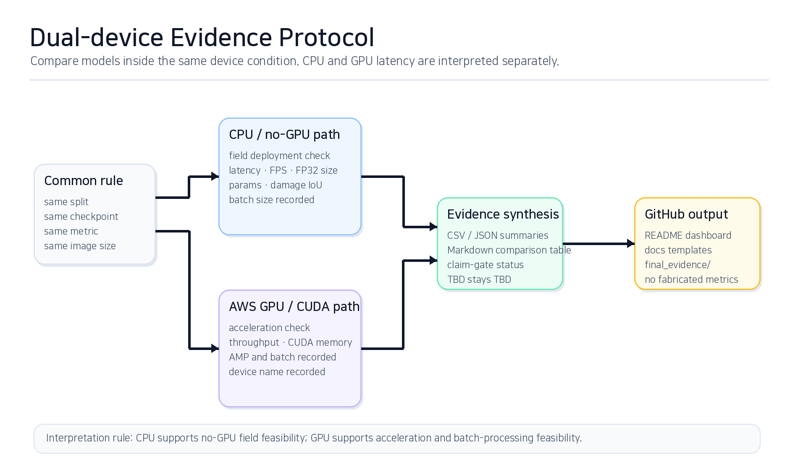

# Evaluation protocol

본 저장소는 단일 mIoU만으로 모델을 평가하지 않습니다. LiteRaceSegNet의 목적은 도로 손상 segmentation에서 accuracy, boundary quality, efficiency, deployment condition 사이의 trade-off를 확인하는 것입니다.

  

## 1. 정확도 및 경계 품질

| Metric | 의미 |
|---|---|
| Pixel Accuracy | 전체 픽셀 정확도. background 비율이 높을 때 과대평가될 수 있음 |
| mIoU | class별 IoU 평균 |
| Damage IoU | 손상 class IoU. 작은 손상 영역 평가에 중요 |
| Dice | overlap 기반 보조 지표 |
| Boundary IoU | 경계 주변 mask 품질 평가 |
| Boundary IoU Drop Rate | stress condition에서 경계 품질이 얼마나 감소하는지 확인 |

## 2. CPU / no-GPU condition

CPU 결과는 GPU가 없는 현장형 추론 가능성을 확인하기 위한 조건입니다.

주요 항목:

- CPU latency mean/std/min/max
- FPS
- parameter count
- FP32 parameter size
- Damage IoU
- input size
- batch size

CPU 결과는 CPU condition 안에서만 LiteRaceSegNet과 baseline을 비교합니다.

## 3. AWS GPU / CUDA condition

GPU 결과는 가속 추론과 대량 처리 가능성을 확인하기 위한 조건입니다.

주요 항목:

- GPU latency mean/std/min/max
- throughput FPS
- CUDA peak memory
- CUDA allocated memory
- AMP 사용 여부
- batch size
- device name

GPU 결과는 GPU condition 안에서만 비교합니다. CPU latency와 GPU latency의 절대값을 직접 비교하지 않습니다.

## 4. Evidence pipeline

| Script | 목적 | 출력 |
|---|---|---|
| `08_CPU_LIGHTWEIGHT_EVIDENCE.bat` | CPU no-GPU evidence | `final_evidence/02_metrics_and_compare_cpu/` |
| `09_GPU_ACCELERATION_EVIDENCE.bat` | GPU acceleration evidence | `final_evidence/02_metrics_and_compare_gpu/` |
| `10_DUAL_DEVICE_RESEARCH_EVIDENCE.bat` | CPU/GPU synthesis | `final_evidence/06_report_ready/final_comparison_table.md` |
| `scripts/run_dual_device_evidence.sh` | Linux/AWS 통합 실행 | CSV/JSON/Markdown evidence |

## 5. Claim gate

결과가 나오기 전에는 다음 표현을 피합니다.

- “SOTA를 달성했다”
- “SegFormer보다 우수하다”
- “Boundary IoU가 개선됐다”
- “현장 배포 가능성이 입증됐다”

결과가 나오기 전 허용되는 표현은 다음 수준입니다.

- “LiteRaceSegNet은 구현되어 있으며 smoke check를 통과한다.”
- “reference model은 124,509 trainable parameters를 가진다.”
- “preliminary validation evidence가 존재하지만, final baseline/latency/boundary 결과는 TBD이다.”
- “CPU/GPU evidence pipeline과 result templates가 포함되어 있다.”
